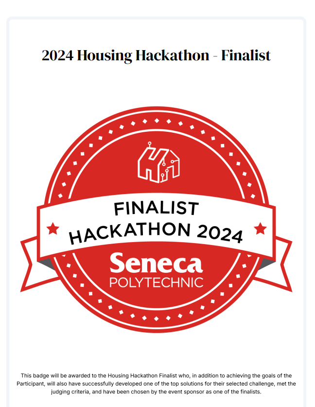

## Affordable Housing Solutions; Seneca Housing Hackathon 2024

Our solution helps users compare housing affordability across Canadian cities by combining machine learning with real housing and economic data.
The goal is to simplify decision-making for individuals and families looking for affordable places to live.

🌐 Live Demo: https://musical-puffpuff-48aa58.netlify.app/

## ✨ Key Features

City Comparison Dashboard – Explore and compare cities based on rental prices, home prices, job opportunities, and local facilities

Machine Learning Recommendations – Get personalized city suggestions based on your input criteria

Interactive Search – Filter by housing costs, employment trends, and amenities to find the best match for your needs

Data-Driven Insights – Visualize housing affordability using reliable public datasets

## 📊 Data Sources

Statistics Canada – Demographic and economic indicators

MLS Home Price Index (HPI) – Housing price trends and affordability metrics

## 🛠️ Tech Stack

Frontend:	React, Next.js
Backend:	Python (Machine Learning Model, API integration)

## ⚡ How It Works

Search – Enter your housing requirements (budget, job opportunities, lifestyle preferences).

Recommendation – The ML model analyzes Statistics Canada and MLS HPI data to identify the most affordable cities matching your criteria.

Explore Details – View city-specific data, including rental prices, employment opportunities, competition levels, and facility availability.

## 🚀 Future Enhancements

Integration of real-time housing market updates

More granular filters (e.g., neighborhood-level analysis)

Interactive maps for visual exploration

